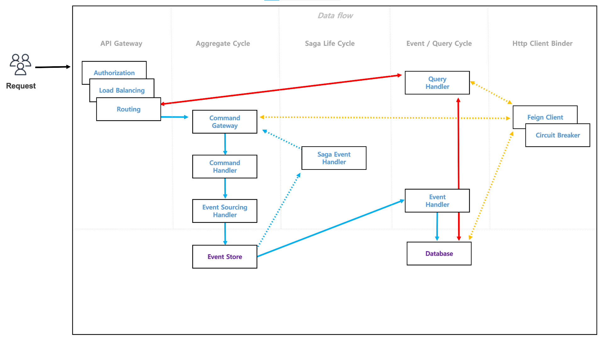
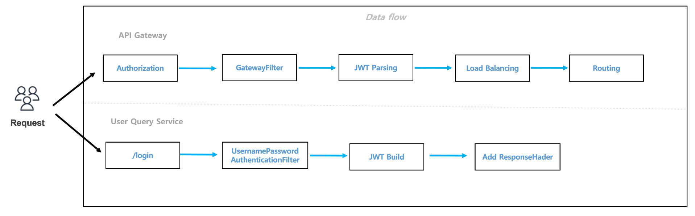

# Netflix OSS Microservice

- GIT Repository -  [Spring Cloud ( Netflix OSS ) 기반 Microservice](https://github.com/on-Sync/spring_cloud_microservice)
- Deploy - `docker-compose -f _docker/docker-compose.yaml up -d`

## 1. Architecture

> Spring Cloud Netflix 프로젝트 대부분이 `Deprecated` 이므로 Spring Cloud 대체 프로젝트를 사용하여 Netflix OSS 를 구성하였다.
참고 - [github.com/spring-cloud/spring-cloud-release/wiki](https://github.com/spring-cloud/spring-cloud-release/wiki/Spring-Cloud-2020.0-Release-Notes#breaking-changes)

## 2. MSA Pattern

> Pattern 기반으로 적용사항을 정리하면 다음과 같다.
참고 - [microservices.io](https://microservices.io/patterns/index.html)

[1) Application Patterns](resource/introduction/application_patterns.md)

[2) Application Infrastructure Patterns](resource/introduction/application_infrastructure_patterns.md)

[3) Infrastructure Patterns](resource/introduction/infrastructure_patterns.md)

## 3. API Process

> 첫째, 데이터 일관성 보장을 목적으로 구성했습니다. 데이터 유연성 및 확장성을 위해 `DDD` + `CQRS` 을 기본으로 합니다.
  둘째, 트랜잭션의 경우 `Database per Service` 형태를 고려하여 `SAGA` 패턴을 적용하며, 보상 및 연관 트랜잭션의 속도를 위해서 `State-Stored Aggregate` 형태로 구성합니다.
  셋째, Command 및 Query 는 Service 별로 소유한 것이 다르기에 최소한의 조건으로 기능을 사용하도록 유도해야합니다. 이때 추가로 요구되는 데이터는 `Http Client Binder` 를 이용하여 소통합니다.
  마지막으로 서비스 장애를 고려합니다. 장애시 `Client Circuit Brekaer` 을 적용하여 사용자불편을 감소시키고, 관리자는 `Zipkin`을 통해 이상데이터를 모니터링하여 유지보수를 진행할 수 있습니다.

## 4. Authentication & Authorization

> API Gateway 및 User Service 를 이용하여 자체 인증처리를 적용합니다.
Authentication 는 `UsernamePasswordAuthenticationFilter` 를 적용한 `/login` 에서 `JWT` 을 발급합니다. 해당 End Point 는 Authorization Filter 적용을 제외합니다. Authorization 는 API Gateway 의 `Authorization Filter` 를 추가합니다. JWT 검증 후에 Routing 을 진행합니다. 추가적으로 API Gateway 에서 `Request Header` 에 추가정보를 담고 Downstream Service 에서 이를 검증할 수 있습니다. 반대로 Service 별로 Security를 적용하여 White List 를 구성할 수 있지만, Microservice 의의 및 Over-Head 를 고려하여 해당방법은 지양합니다.

## 5. Review

### 1) To Do & To Be

> 현재 템플릿 구현목적이기에 다음과 같은 개선사항 남아있습니다.
- Request & Response format 적용
- Docker Deploy Probe 추가
- API Function 보완
- Redis caching 구현
- Data Batch Scheduling 구현

### 2) Thought

> 본 프로젝트는 Java, Spring, Netflix OSS 을 통한 MSA 생태계를 확인하는 것을 중점으로 진행했습니다. k8s 와 비교했을 때, Auto scaling, Deployment 분야가 부족했기에 Docker Compose, Dockerize 와 같은 3rd party 가 필요했습니다. 대신 Service mesh, Gateway 등 Infra 쪽을 Java 로 구현할 수 있다는 장점이 있었고, Polyglot 구현이 필수가 아닌 Java 가 주력인 팀에서 사용하기 좋았습니다.
- 참고 - [서비스 경량화를 위한 MSA 설계 시 고려사항](https://www.samsungsds.com/kr/insights/1239180_4627.html) 
           - [넷플릭스로 알아보는 MSA](https://www.samsungsds.com/kr/insights/msa_and_netflix.html)
